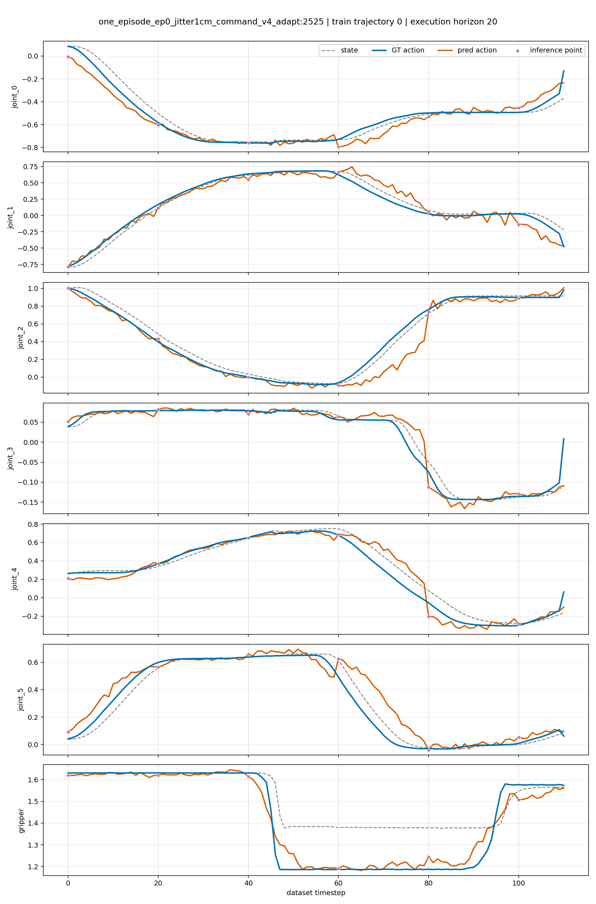
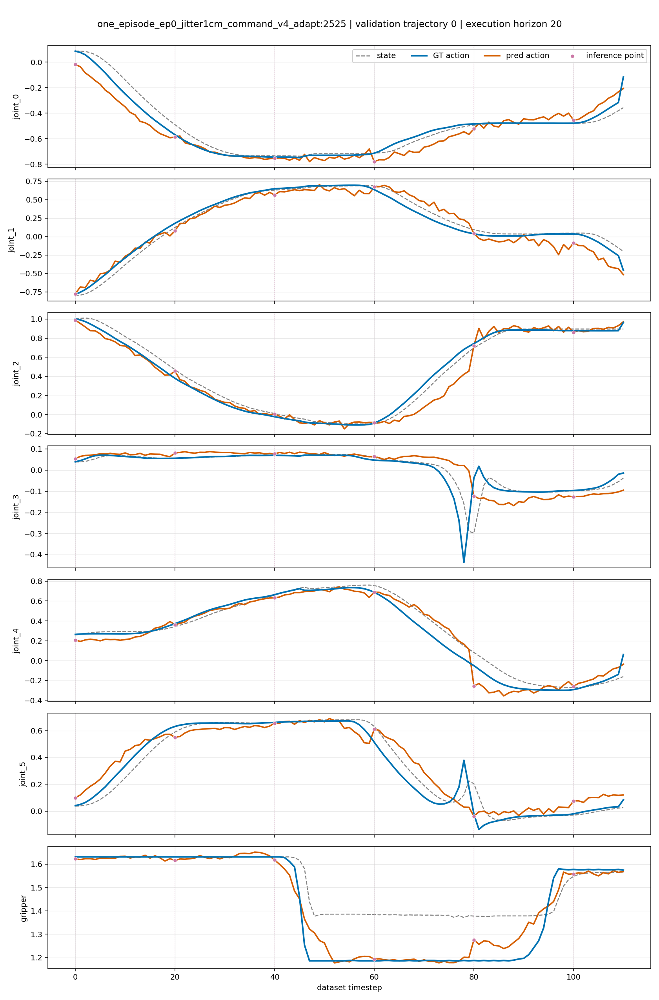

# Open-Loop Evaluation Report: Two Octo ALOHA Carrot Checkpoints

Evaluation date: **2026-08-01**
Status: **complete**

## 1. Objective

This report presents an open-loop evaluation of two fine-tuned Octo policies:

1. `aloha_carrot_w2_h8_stageb_seed42`, checkpoint step `20000`;
2. `one_episode_ep0_jitter1cm_command_v4_adapt`, checkpoint step `2525`.

The objective is to determine whether each policy can reproduce the actions in
the demonstrations and to measure the gap between its training and validation
trajectories. This is not a simulation rollout and does not measure task
success.

## 2. Protocol

The protocol was adapted from:

- [Isaac-GR00T: Step 4 — Open Loop Evaluation](https://github.com/NVIDIA/Isaac-GR00T/blob/main/getting_started/finetune_new_embodiment.md#step-4-open-loop-evaluation)
- [NVIDIA `gr00t/eval/open_loop_eval.py`](https://github.com/NVIDIA/Isaac-GR00T/blob/main/gr00t/eval/open_loop_eval.py)

At each inference point, the evaluator:

1. retrieves the ground-truth observation history from the RLDS trajectory;
2. passes the observations and language instruction to the checkpoint;
3. predicts an action chunk;
4. takes the first `execution_horizon` actions from the chunk;
5. concatenates the predicted chunks over time;
6. compares them with the corresponding ground-truth actions;
7. computes MAE, MSE, and RMSE over valid action values;
8. saves GT-vs-prediction plots and NumPy traces for auditing.

The observations always come from the recorded dataset trajectory
(teacher-forced). Predicted actions are not fed back into a simulator or used
to generate subsequent observations. The results therefore measure action
imitation quality only.

The `original_units` metrics are computed after reversing each checkpoint's
normalization. The first six dimensions are joint actions, and the final
dimension is the follower-gripper command. The `normalized` metrics are
retained for normalization debugging and should not be used for direct
comparison between the two datasets.

## 3. Evaluation Configuration

| Model | Checkpoint | Dataset | Window | Action horizon | Execution horizon |
|---|---:|---|---:|---:|---:|
| `aloha_carrot_w2_h8_stageb_seed42` | 20000 | `aloha_carrot_easy_rlds` | 2 | 8 | 8 |
| `one_episode_ep0_jitter1cm_command_v4_adapt` | 2525 | `aloha_carrot_sim_rlds` with ±1 cm jitter | 1 | 20 | 20 |

Each model was evaluated on trajectory index `0` from both splits:

| Model | Split | Trajectory index | Source episode | Number of steps | Inference calls |
|---|---|---:|---:|---:|---:|
| step 20000 | train | 0 | 0 | 149 | 19 |
| step 20000 | validation | 0 | 6 | 160 | 20 |
| robust step 2525 | train | 0 | 0 | 111 | 6 |
| robust step 2525 | validation | 0 | 24 | 111 | 6 |

Although `steps=200` was requested, the evaluator automatically limits the
number of steps to the trajectory length.

## 4. Main Results

### 4.1 Metrics in Original Action Units

| Checkpoint | Split | MAE | MSE | RMSE | Gripper accuracy |
|---|---|---:|---:|---:|---:|
| step 20000 | train | 0.028095 | 0.001925 | 0.043876 | 97.99% |
| step 20000 | validation | 0.171922 | 0.097308 | 0.311942 | 96.88% |
| robust step 2525 | train | 0.048855 | 0.006948 | 0.083355 | 99.10% |
| robust step 2525 | validation | 0.055884 | 0.006743 | 0.082118 | 99.10% |

### 4.2 Generalization Gap

| Checkpoint | Train MAE | Validation MAE | Difference | Validation / Train |
|---|---:|---:|---:|---:|
| step 20000 | 0.028095 | 0.171922 | +0.143827 | **6.12×** |
| robust step 2525 | 0.048855 | 0.055884 | +0.007029 | **1.14×** |

### 4.3 MAE by Action Dimension

| Checkpoint / split | j0 | j1 | j2 | j3 | j4 | j5 | gripper |
|---|---:|---:|---:|---:|---:|---:|---:|
| step 20000 train | 0.0211 | 0.0352 | 0.0272 | 0.0186 | 0.0304 | 0.0470 | 0.0171 |
| step 20000 validation | 0.0483 | 0.0771 | 0.0552 | **0.4440** | 0.0807 | **0.4663** | 0.0319 |
| robust 2525 train | 0.0453 | 0.0769 | 0.0632 | 0.0103 | 0.0569 | 0.0624 | 0.0270 |
| robust 2525 validation | 0.0524 | 0.0897 | 0.0561 | 0.0370 | 0.0582 | 0.0708 | 0.0270 |

### 4.4 Normalized Metrics for Auditing

| Checkpoint | Split | Normalized MAE | Normalized MSE |
|---|---|---:|---:|
| step 20000 | train | 0.105843 | 0.036207 |
| step 20000 | validation | 0.889350 | 3.408159 |
| robust step 2525 | train | 0.154744 | 0.065366 |
| robust step 2525 | validation | 0.210640 | 0.150732 |

### 4.5 GT-vs-Prediction Plots

Blue lines show ground-truth actions, orange lines show predicted actions, and
dashed gray lines show the reference state. Purple circles and vertical dotted
lines mark inference points. In addition to the high-contrast palette, distinct
line styles and markers keep the plots legible in grayscale and for readers
with color-vision deficiencies.

**Checkpoint at step 20000 — train trajectory 0**


**Checkpoint at step 20000 — validation trajectory 0**


**Robust checkpoint at step 2525 — train trajectory 0**



**Robust checkpoint at step 2525 — validation trajectory 0**



## 5. Interpretation

### Checkpoint at Step 20000

The predictions on training episode 00 track the ground truth fairly closely.
However, the validation MAE is `6.12×` higher than the training MAE. Most of
the error is concentrated in joints 3 and 5, with MAEs of `0.4440` and
`0.4663`, respectively. The gripper state is still predicted correctly most of
the time, so its high accuracy does not compensate for the joint-trajectory
errors.

These results clearly show that the checkpoint at step 20000 fits the training
trajectory well but generalizes poorly to held-out episode 6.

### Robust Checkpoint at Step 2525

The validation MAE is only about `14.4%` higher than the training MAE. No action
dimension exhibits a sharp increase comparable to the step-20000 checkpoint.
This is consistent with the objective of fine-tuning with ±1 cm jitter: accept
slightly higher training error in exchange for more stable predictions on a
held-out layout from the same distribution.

### These Metrics Must Not Be Interpreted as a Success Rate

Open-loop evaluation does not simulate state drift, contact, grasp failures,
or recovery. A policy with low MAE can still fail in closed loop; conversely, a
policy with some joint deviation may still complete the task through feedback
and replanning. The robust checkpoint's closed-loop result of `8/10` is an
independent measurement and is not included in the MAE/MSE values in this
report.

The two checkpoint rows are also not a completely fair absolute comparison
because they use different datasets, trajectories, normalization schemes, and
action horizons. The most reliable signal in this report is the
**within-model generalization gap**.

## 6. Generated Artifacts

The local results are stored under:

```text
outputs/eval/open_loop_two_models_20260801/
├── aloha_carrot_w2_h8_stageb_step20000/
│   ├── summary.json
│   ├── trajectory_metrics.csv
│   ├── train/trajectory_000_gt_vs_pred.png
│   ├── train/trajectory_000_actions.npz
│   ├── validation/trajectory_000_gt_vs_pred.png
│   └── validation/trajectory_000_actions.npz
└── one_episode_ep0_jitter1cm_command_v4_step2525/
    ├── summary.json
    ├── trajectory_metrics.csv
    ├── train/trajectory_000_gt_vs_pred.png
    ├── train/trajectory_000_actions.npz
    ├── validation/trajectory_000_gt_vs_pred.png
    └── validation/trajectory_000_actions.npz
```

The complete artifacts under `outputs/` are ignored by Git. This report records
all required metrics, while the JSON, CSV, and NumPy trace files remain
available locally for auditing. The four GT-vs-prediction plots in section 4.5
are stored under `docs/assets/open_loop/` and committed to Git so that they are
displayed directly on GitHub.

## 7. Reproduction

Run the two checkpoints sequentially to avoid exhausting host RAM:

```bash
PYTHON_BIN=/home/linh/anaconda3/envs/octo_pt/bin/python \
OUTPUT_ROOT=outputs/eval/open_loop_two_models_20260801 \
SPLITS=train,validation \
TRAJ_IDS=0 \
STEPS=200 \
DEVICE=cuda:0 \
bash scripts/run_octo_two_model_open_loop.sh
```

Run an individual checkpoint:

```bash
/home/linh/anaconda3/envs/octo_pt/bin/python \
  scripts/evaluate_octo_open_loop.py \
  --checkpoint-dir checkpoints/octo/aloha_carrot_w2_h8_stageb_seed42 \
  --checkpoint-step 20000 \
  --splits train,validation \
  --traj-ids 0 \
  --steps 200 \
  --execution-horizon 0 \
  --device cuda:0 \
  --output-dir outputs/eval/open_loop_step20000
```

`--execution-horizon 0` automatically selects the checkpoint's full action
horizon. A smaller value can be supplied to evaluate a denser replanning
protocol, but it must not exceed the model's action horizon.

## 8. Technical Checks

- The evaluator ran end-to-end on both checkpoints.
- All traces have shape `(T, 7)` for predictions, ground truth, and valid masks.
- The step-20000 checkpoint used 19/20 inference calls for train/validation.
- The robust checkpoint used 6 inference calls on each trajectory.
- `python -m unittest tests.test_train_utils_pt` completed successfully.
- Python compilation, Bash syntax checking, and `git diff --check` all passed.
- The two models were loaded sequentially rather than occupying RAM/GPU at the
  same time.
