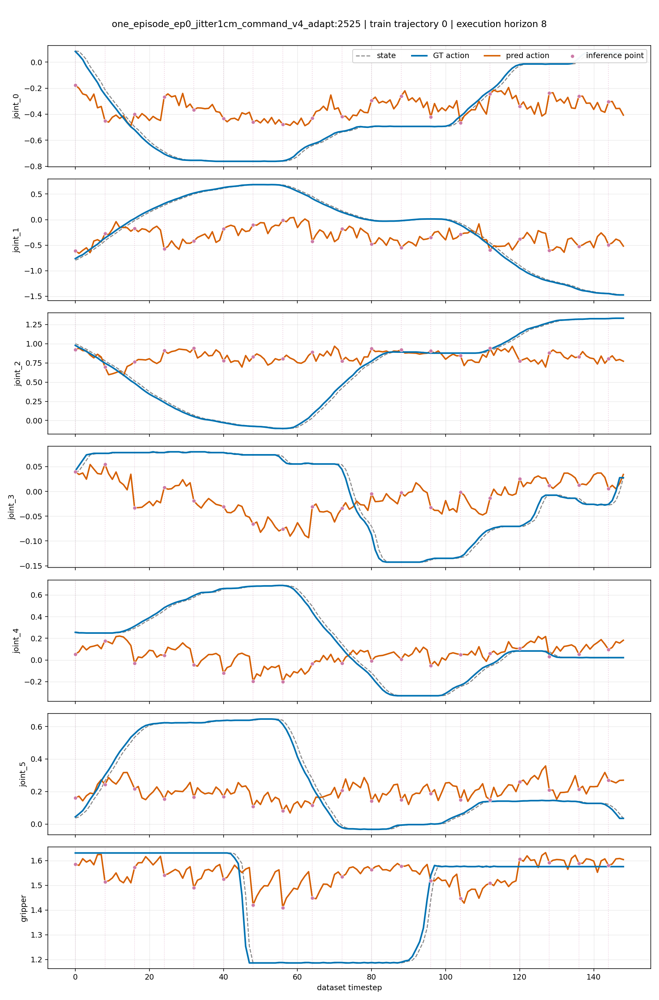
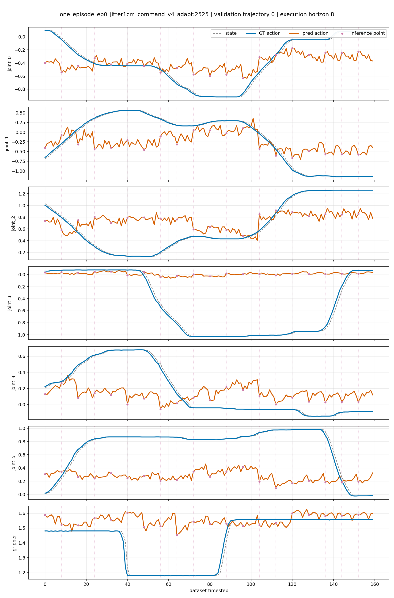

# Open-Loop Evaluation Report: Two Octo ALOHA Carrot Checkpoints on Original Data

Re-evaluation date: **2026-08-03**
Status: **complete**

## 1. Objective

This report presents an open-loop evaluation of two fine-tuned Octo policies:

1. `aloha_carrot_w2_h8_stageb_seed42`, checkpoint step `20000`;
2. `one_episode_ep0_jitter1cm_command_v4_adapt`, checkpoint step `2525`.

The objective is to determine whether each policy can reproduce the actions in
the demonstrations and to measure the gap between its training and validation
trajectories. Both checkpoints are evaluated on the same original trajectories
at the same inference frequency so that their results can be compared. This is
not a simulation rollout and does not measure task success.

## 2. Protocol

The protocol was adapted from:

- [Isaac-GR00T: Step 4 — Open Loop Evaluation](https://github.com/NVIDIA/Isaac-GR00T/blob/main/getting_started/finetune_new_embodiment.md#step-4-open-loop-evaluation)
- [NVIDIA `gr00t/eval/open_loop_eval.py`](https://github.com/NVIDIA/Isaac-GR00T/blob/main/gr00t/eval/open_loop_eval.py)

At each inference point, the evaluator:

1. retrieves the ground-truth observation history from the RLDS trajectory;
2. passes the observations and language instruction to the checkpoint;
3. predicts an action chunk;
4. takes the first `execution_horizon` actions from the chunk;
5. concatenates the predicted chunks over time;
6. compares them with the corresponding ground-truth actions;
7. computes MAE, MSE, and RMSE over valid action values;
8. saves GT-vs-prediction plots and NumPy traces for auditing.

The observations always come from the recorded dataset trajectory
(teacher-forced). Predicted actions are not fed back into a simulator or used
to generate subsequent observations. The results therefore measure action
imitation quality only.

The `original_units` metrics are computed after reversing each checkpoint's
normalization. The first six dimensions are joint actions, and the final
dimension is the follower-gripper command. The `normalized` metrics are
retained for normalization debugging and should not be used for direct
comparison between the checkpoints because they use different statistics.

## 3. Evaluation Configuration

| Model | Checkpoint | Evaluation dataset | Window | Action horizon | Execution horizon |
|---|---:|---|---:|---:|---:|
| `aloha_carrot_w2_h8_stageb_seed42` | 20000 | `aloha_carrot_easy_rlds` | 2 | 8 | 8 |
| `one_episode_ep0_jitter1cm_command_v4_adapt` | 2525 | `aloha_carrot_easy_rlds` | 1 | 20 | 8 |

Both models use the same original RLDS evaluation dataset at
`outputs/derived/aloha_carrot_easy_rlds`. The step-20000 checkpoint uses
normalization statistics from the full training split; the step-2525
checkpoint retains the episode-0 normalization statistics required by its
fine-tuning contract. All comparative metrics below use `original_units`.

Each model was evaluated on trajectory index `0` from both splits:

| Model | Split | Trajectory index | Source episode | Number of steps | Inference calls |
|---|---|---:|---:|---:|---:|
| step 20000 | train | 0 | 0 | 149 | 19 |
| step 20000 | validation | 0 | 6 | 160 | 20 |
| jitter-adapted step 2525 | train | 0 | 0 | 149 | 19 |
| jitter-adapted step 2525 | validation | 0 | 6 | 160 | 20 |

Although `steps=200` was requested, the evaluator automatically limits the
number of steps to the trajectory length.

## 4. Main Results

### 4.1 Metrics in Original Action Units

| Checkpoint | Split | MAE | MSE | RMSE | Gripper accuracy |
|---|---|---:|---:|---:|---:|
| step 20000 | train | 0.028095 | 0.001925 | 0.043876 | 97.99% |
| step 20000 | validation | 0.171922 | 0.097308 | 0.311942 | 96.88% |
| jitter-adapted step 2525 | train | 0.280125 | 0.145849 | 0.381901 | 67.11% |
| jitter-adapted step 2525 | validation | 0.353794 | 0.205040 | 0.452813 | 70.00% |

### 4.2 Generalization Gap

| Checkpoint | Train MAE | Validation MAE | Difference | Validation / Train |
|---|---:|---:|---:|---:|
| step 20000 | 0.028095 | 0.171922 | +0.143827 | **6.12×** |
| jitter-adapted step 2525 | 0.280125 | 0.353794 | +0.073669 | **1.26×** |

### 4.3 MAE by Action Dimension

| Checkpoint / split | j0 | j1 | j2 | j3 | j4 | j5 | gripper |
|---|---:|---:|---:|---:|---:|---:|---:|
| step 20000 train | 0.0211 | 0.0352 | 0.0272 | 0.0186 | 0.0304 | 0.0470 | 0.0171 |
| step 20000 validation | 0.0483 | 0.0771 | 0.0552 | **0.4440** | 0.0807 | **0.4663** | 0.0319 |
| jitter-adapted 2525 train | 0.2422 | **0.5394** | 0.4049 | 0.0828 | 0.3126 | 0.2297 | 0.1494 |
| jitter-adapted 2525 validation | 0.2375 | 0.4469 | 0.3273 | **0.5432** | 0.2700 | **0.5104** | 0.1413 |

### 4.4 Normalized Metrics for Auditing

| Checkpoint | Split | Normalized MAE | Normalized MSE |
|---|---|---:|---:|
| step 20000 | train | 0.105843 | 0.036207 |
| step 20000 | validation | 0.889350 | 3.408159 |
| jitter-adapted step 2525 | train | 0.871781 | 1.123849 |
| jitter-adapted step 2525 | validation | 1.763214 | 11.760666 |

### 4.5 GT-vs-Prediction Plots

Blue lines show ground-truth actions, orange lines show predicted actions, and
dashed gray lines show the reference state. Purple circles and vertical dotted
lines mark inference points. In addition to the high-contrast palette, distinct
line styles and markers keep the plots legible in grayscale and for readers
with color-vision deficiencies.

**Checkpoint at step 20000 — train trajectory 0**


**Checkpoint at step 20000 — validation trajectory 0**


**Jitter-adapted checkpoint at step 2525 — train trajectory 0**



**Jitter-adapted checkpoint at step 2525 — validation trajectory 0**



## 5. Interpretation

### Checkpoint at Step 20000

The predictions on training episode 00 track the ground truth fairly closely.
However, the validation MAE is `6.12×` higher than the training MAE. Most of
the error is concentrated in joints 3 and 5, with MAEs of `0.4440` and
`0.4663`, respectively. The gripper state is still predicted correctly most of
the time, so its high accuracy does not compensate for the joint-trajectory
errors.

These results clearly show that the checkpoint at step 20000 fits the training
trajectory well but generalizes poorly to held-out episode 6.

### Jitter-Adapted Checkpoint at Step 2525

On the original episode 0, this checkpoint has an MAE of `0.280125`, nearly
`10×` the step-20000 checkpoint's MAE. Its validation MAE is `0.353794`, about
`2.06×` the step-20000 result on the same episode 6. Gripper accuracy is also
only `67.11%` on train and `70.00%` on validation.

The `1.26×` generalization ratio does not mean this checkpoint is better: its
training error is already very high. The plots show substantial prediction
errors across several joints even on episode 0. The result only establishes
that the jitter-adapted checkpoint does not reproduce the original dataset's
actions well under this open-loop protocol; metrics from the simulated dataset
must not be substituted here.

### These Metrics Must Not Be Interpreted as a Success Rate

Open-loop evaluation does not simulate state drift, contact, grasp failures,
or recovery. A policy with low MAE can still fail in closed loop; conversely, a
policy with some joint deviation may still complete the task through feedback
and replanning. Closed-loop results are independent measurements and are not
included in the MAE/MSE values in this report.

The checkpoints use identical observations, ground-truth actions, and an
`execution_horizon` of 8. Their GT traces differ by less than `1.2e-7` at most
due to floating-point rounding. Their window sizes, action horizons, and
normalization contracts still differ, so the metrics and plots should be read
together rather than treated as an absolute architecture comparison.

## 6. Generated Artifacts

The local results are stored under:

```text
outputs/eval/open_loop_two_models_original_data/
├── aloha_carrot_w2_h8_stageb_step20000/
│   ├── summary.json
│   ├── trajectory_metrics.csv
│   ├── train/trajectory_000_gt_vs_pred.png
│   ├── train/trajectory_000_actions.npz
│   ├── validation/trajectory_000_gt_vs_pred.png
│   └── validation/trajectory_000_actions.npz
└── one_episode_ep0_jitter1cm_command_v4_step2525/
    ├── summary.json
    ├── trajectory_metrics.csv
    ├── train/trajectory_000_gt_vs_pred.png
    ├── train/trajectory_000_actions.npz
    ├── validation/trajectory_000_gt_vs_pred.png
    └── validation/trajectory_000_actions.npz
```

The complete artifacts under `outputs/` are ignored by Git. This report records
all required metrics, while the JSON, CSV, and NumPy trace files remain
available locally for auditing. The four GT-vs-prediction plots in section 4.5
are stored under `docs/assets/open_loop/` and committed to Git so that they are
displayed directly on GitHub.

## 7. Reproduction

Run the two checkpoints sequentially to avoid exhausting host RAM:

```bash
PYTHON_BIN=/home/linh/anaconda3/envs/octo_pt/bin/python \
OUTPUT_ROOT=outputs/eval/open_loop_two_models_original_data \
DATA_DIR=outputs/derived/aloha_carrot_easy_rlds \
DATASET_NAME=aloha_carrot_easy_rlds \
SPLITS=train,validation \
TRAJ_IDS=0 \
STEPS=200 \
EXECUTION_HORIZON=8 \
DEVICE=cuda:0 \
bash scripts/run_octo_two_model_open_loop.sh
```

Run the jitter-adapted checkpoint separately on the original data:

```bash
/home/linh/anaconda3/envs/octo_pt/bin/python \
  scripts/evaluate_octo_open_loop.py \
  --checkpoint-dir checkpoints/octo/one_episode_ep0_jitter1cm_command_v4_adapt \
  --checkpoint-step 2525 \
  --data-dir outputs/derived/aloha_carrot_easy_rlds \
  --dataset-name aloha_carrot_easy_rlds \
  --splits train,validation \
  --traj-ids 0 \
  --steps 200 \
  --execution-horizon 8 \
  --device cuda:0 \
  --output-dir outputs/eval/open_loop_jitter_adapted_original_data
```

An `execution_horizon` of 8 gives both checkpoints identical inference points.
The step-2525 checkpoint still predicts 20-action chunks, but the evaluator
uses only the first 8 actions before the next inference call.

## 8. Technical Checks

- The evaluator ran end-to-end on both checkpoints.
- All traces have shape `(T, 7)` for predictions, ground truth, and valid masks.
- The step-20000 checkpoint used 19/20 inference calls for train/validation.
- The jitter-adapted checkpoint used 19/20 inference calls for train/validation.
- Both the original Parquet files and RLDS confirm that training episode 0 has
  149 steps and validation episode 6 has 160 steps.
- The two checkpoints' ground-truth traces have matching shapes and valid
  masks, with a maximum difference below `1.2e-7`.
- The previous 111-step result came from the simulated
  `aloha_carrot_ep0_jitter1cm_command_v4_npz/episode_000000.npz` trajectory,
  which stops when the success reward is reached; that result has been removed
  from this report.
- `python -m unittest tests.test_train_utils_pt` completed successfully.
- Python compilation, Bash syntax checking, and `git diff --check` all passed.
- The two models were loaded sequentially rather than occupying RAM/GPU at the
  same time.
