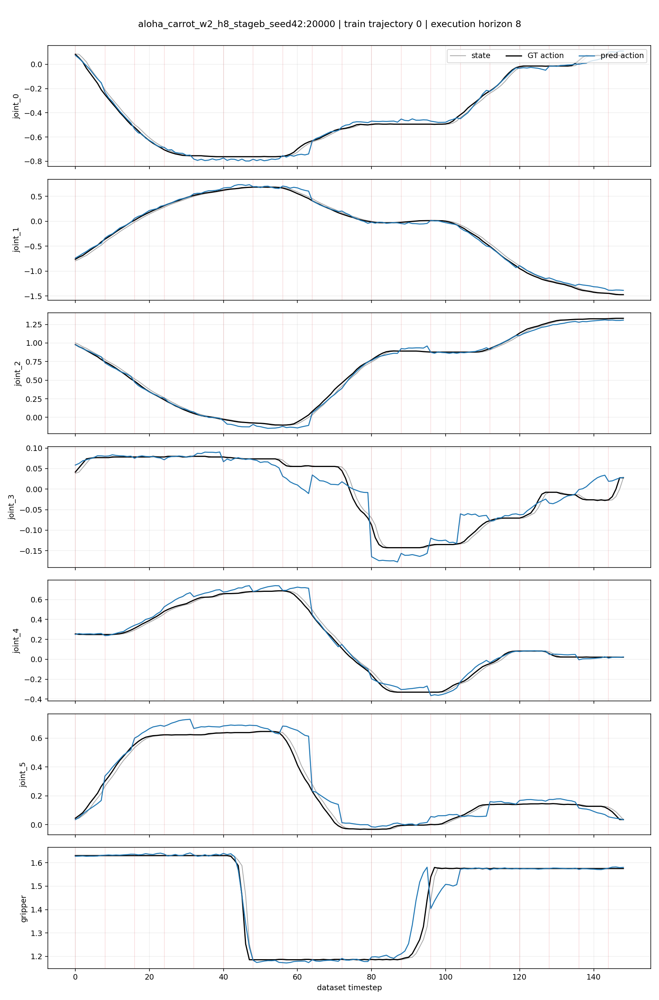
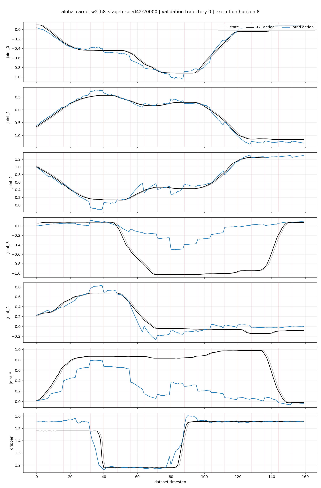
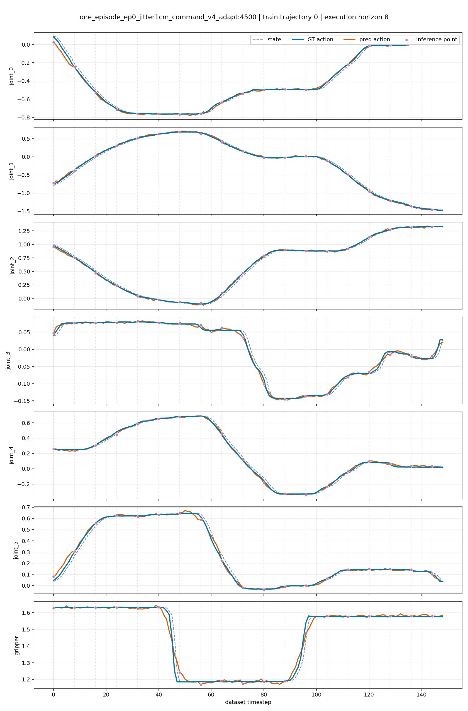

# Báo cáo open-loop: checkpoint full-data và overfit real episode 0

Ngày đánh giá lại: **2026-08-04**
Trạng thái: **hoàn tất**

## Mục tiêu và protocol

Báo cáo đo teacher-forced open-loop: tại mỗi inference point, policy nhận
observation thật trong RLDS, dự đoán action chunk 20D theo thời gian, evaluator
lấy 8 action đầu rồi so sánh trực tiếp với ground truth. Prediction không được
đưa ngược vào simulator; đây là metric imitation, không phải task success.

Metric trong bảng là `original_units` (sau unnormalize theo statistics của từng
checkpoint). Đường xanh trong plot là GT, cam là prediction, xám nét đứt là
state và chấm tím là inference point.

## Checkpoint và dữ liệu

| Model | Step | Dữ liệu dùng khi fine-tune | Dữ liệu open-loop |
|---|---:|---|---|
| `aloha_carrot_w2_h8_stageb_seed42` | 20000 | full data | RLDS gốc: train ep0, validation ep6 |
| `one_episode_ep0_jitter1cm_command_v4_adapt` | 4500 | real-data episode 0 | RLDS episode 0: chỉ split `train` |

Checkpoint 20000 chỉ được load để evaluate, không bị sửa. Checkpoint step 4500
resume từ step 2500 và tiếp tục overfit trên đúng demonstration real episode 0.

## Kết quả

| Checkpoint | Split / episode | MAE | MSE | RMSE | Gripper accuracy |
|---|---|---:|---:|---:|---:|
| step 20000 | train / ep0 | 0.028095 | 0.001925 | 0.043876 | 97.99% |
| step 20000 | validation / ep6 | 0.171922 | 0.097308 | 0.311942 | 96.88% |
| real ep0 overfit step 2500 | train / ep0 | 0.011425 | 0.000353 | 0.018779 | 99.33% |
| **real ep0 overfit step 4500** | **train / ep0** | **0.008951** | **0.000212** | **0.014549** | **99.33%** |

Step 4500 giảm MAE episode 0 thêm 21.6% so với step 2500 và thấp hơn 68.1%
so với step 20000 trên cùng episode. Đây là checkpoint được cấu hình trong
`scripts/run_octo_two_model_open_loop.sh`.

Không có hàng validation cho step 4500: dataset overfit chứa duy nhất split
`train`; yêu cầu split `validation` là sai contract và TFDS từ chối. Vì vậy plot
validation không phải tiêu chí để đánh giá model overfit episode 0.

## Biểu đồ GT-vs-prediction

**Checkpoint step 20000 — train episode 0**



**Checkpoint step 20000 — validation episode 6**



**Checkpoint real episode-0 overfit step 4500 — train episode 0**



Hai biểu đồ đầu giữ nguyên để tham chiếu checkpoint 20000. Biểu đồ thứ ba là
plot mới và là biểu đồ cần dùng để đánh giá overfit; không có biểu đồ validation
cho step 4500 vì dataset này không có split validation.

## Artifact và cách xem đúng plot

Plot cần dùng để kiểm tra overfit là:

```text
outputs/eval/open_loop_real_ep0_step4500_train/train/trajectory_000_gt_vs_pred.png
```

Nó dùng 149 bước của train episode 0, 19 inference calls, action horizon 20 và
execution horizon 8. Summary audit ở:

```text
outputs/eval/open_loop_real_ep0_step4500_train/summary.json
```

Để chạy lại evaluator chỉ cho mục tiêu overfit:

```bash
/home/linh/anaconda3/envs/octo_pt/bin/python scripts/evaluate_octo_open_loop.py \
  --checkpoint-dir checkpoints/octo/one_episode_ep0_jitter1cm_command_v4_adapt \
  --checkpoint-step 4500 \
  --data-dir outputs/derived/aloha_carrot_ep0_rlds \
  --dataset-name aloha_carrot_easy_rlds \
  --dataset-statistics outputs/derived/aloha_carrot_ep0_rlds/aloha_carrot_easy_rlds/1.0.0/octo_dataset_statistics.json \
  --splits train --traj-ids 0 --steps 200 --execution-horizon 8 --device cuda:0 \
  --output-dir outputs/eval/open_loop_real_ep0_step4500_train
```

`outputs/` bị Git ignore; summary, CSV, NPZ và plot được giữ local để audit.
